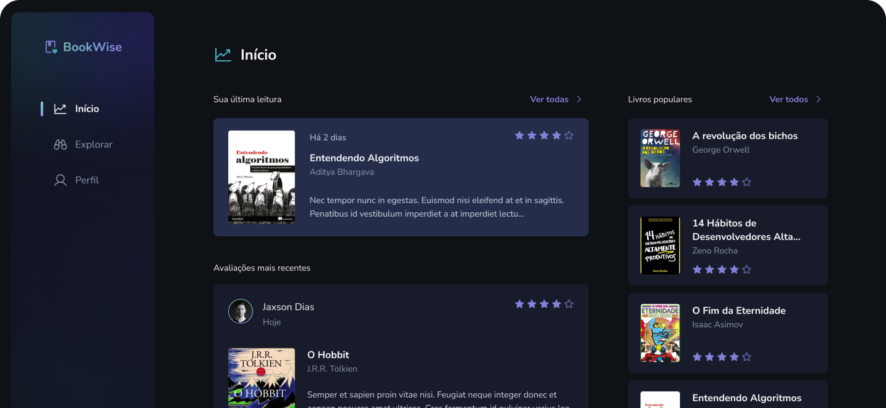

<h4 align="center">
  
</h4>

<h4 align="center">
    <p align="center">
      <a href="#-about">About</a>&nbsp;&nbsp;&nbsp;|&nbsp;&nbsp;&nbsp;
      <a href="#-technologies">Technologies</a>&nbsp;&nbsp;&nbsp;|&nbsp;&nbsp;&nbsp;
      <a href="#-how-to-run-the-project">Run</a>&nbsp;&nbsp;&nbsp;|&nbsp;&nbsp;&nbsp;
      <a href="#-info">Info</a>&nbsp;&nbsp;&nbsp;|&nbsp;&nbsp;&nbsp;
      <a href="#-license">License</a>
  </p>
</h4>

<h1 align="center">
  
</h1>

## 🔖 About

Bookwise é o sexto desafio do curso Ignite da Rocketseat. Neste desafio, aplico todo o conhecimento que adquiri no módulo para criar uma plataforma de recomendações para leitores.

A ideia é oferecer um espaço onde os usuários possam avaliar livros e ver as avaliações de outros usuários sobre diversas obras literárias. Também é possível pesquisar por livros, adicionar livros a uma lista de desejos e recomendar livros para outros usuários.

Durante o desenvolvimento da plataforma, aplico conceitos importantes de desenvolvimento web, como a criação de APIs, o uso de bancos de dados, o desenvolvimento de interfaces responsivas e a implementação de autenticação e autorização.

- [Detalhes](docs/ABOUT.md)

## 🚀 Technologies

- [NextJS](https://nextjs.org/)
- [Typescript](https://www.typescriptlang.org/)
- [Prisma](https://www.prisma.io/)
- [NextAuth](https://next-auth.js.org/)
- [Stitches](https://stitches.dev/)
- [ReactQuery](https://tanstack.com/query/latest)

## 🏁 How to run the project

```sh
# Clone the repository
git clone https://github.com/rafinhaa/bookwise.git
cd bookwise

# Install the dependencies
yarn install

# Make a copy of '.env.example' to '.env'
cp .env.example .env

# Start the application
yarn run dev
```

## ℹ️ Info

## 📄 Changelog

## 📝 License

[MIT](LICENSE.txt)

**Free Software, Hell Yeah!**
